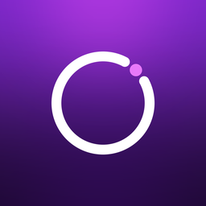
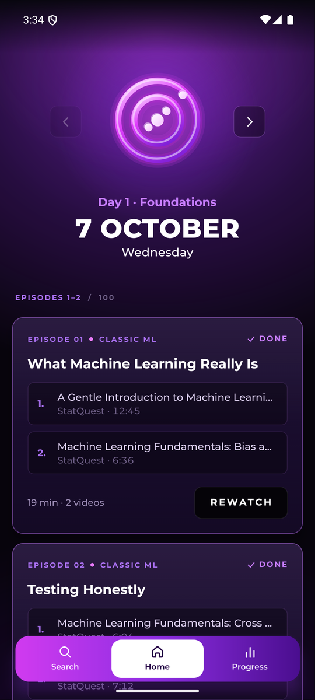
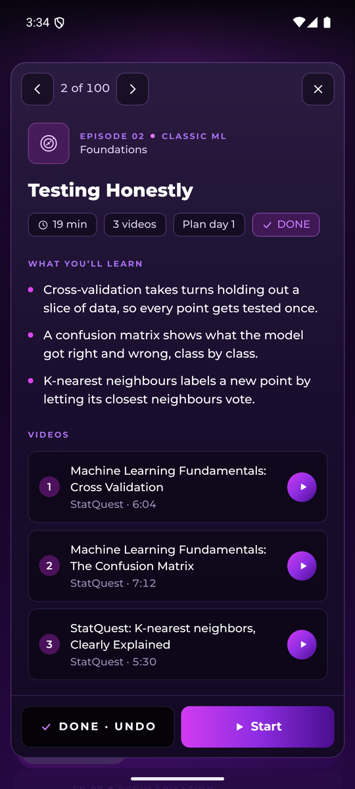
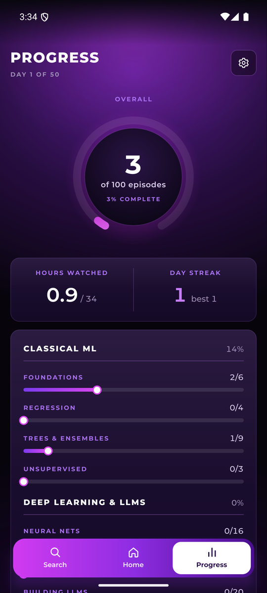

<div align="center">



# Epoch

**A 50-day ML study plan that fits into lunch.** 100 short episodes, two a day, from classic ML to how LLMs are trained, tuned, given retrieval and turned into agents.






</div>

---

## What it does

| | |
|---|---|
| **Today** | Two episodes a day, shown as cards. Finish only one and the other carries over to tomorrow. The ← → arrows page through the rest of the plan whenever you want more. |
| **Episodes** | Each card lists its videos with exact time ranges. **Start** opens YouTube at the right second. Tap a card for its summary, hold it to mark it done. |
| **Search** | Full-text search over names, summaries, channels and review questions, with filters for phase, status, type, length and sort order. Ten results a page; tap one for its full sheet. |
| **Progress** | An overall progress dial, a slider for every phase group, a 50-day activity chart, hours watched and your streak. |

Everything lives on the device. No account, no network calls except YouTube itself.

## The plan

| Phase | Episodes | Covers |
|---|---|---|
| Classic ML | 1–22 | metrics, regression, regularisation, trees, boosting, SVMs, clustering, PCA |
| Neural nets | 23–38 | backprop, optimisers, CNNs, RNNs, LSTMs, embeddings, attention |
| Transformers | 39–47 | self-attention, decoder-only models, BERT |
| How LLMs are built | 48–67 | pretraining, post-training, RLHF, scaling laws |
| AI engineering | 68–100 | RAG, fine-tuning, LoRA, agents, MCP, evals, prompting |

Video titles, channels and lengths were checked against YouTube on 2026-10-06. Review episodes have no video, just questions to answer out loud.

## Build it

Expo SDK 57, React Native 0.86, TypeScript. Animation is Reanimated 4, every icon and illustration is hand-drawn `react-native-svg`, screens sit on a black-to-violet environment with dark purple panels and magenta-to-violet gradient controls, and the type is Montserrat.

```bash
npm install
npm test                 # schedule logic and plan data
npx tsc --noEmit
npx expo run:android     # dev build on a device or emulator
```

On Windows, build from a short path (for example `C:\ep`), or CMake trips over the 260-character path limit. A release APK for ARM phones:

```bash
npx expo prebuild -p android
cd android && ./gradlew assembleRelease -PreactNativeArchitectures=arm64-v8a,armeabi-v7a
```

## Layout

```
src/data/plan.ts        the 100 episodes: videos, time ranges, names, summaries
src/lib/schedule.ts     pure logic: daily queue, carry-over, streaks, rings (tested)
src/theme.ts            design tokens: environment, panel and gradient colours, type scale
src/screens/            Home · Search · Progress
src/components/         Ambient, Glass (panel), Buttons, Dial, EpisodeCard, EpisodeSheet, Pager, TabBar, illustrations
```
