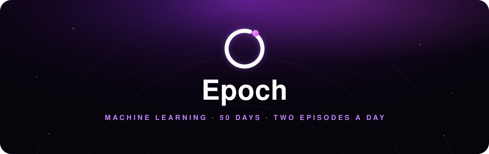
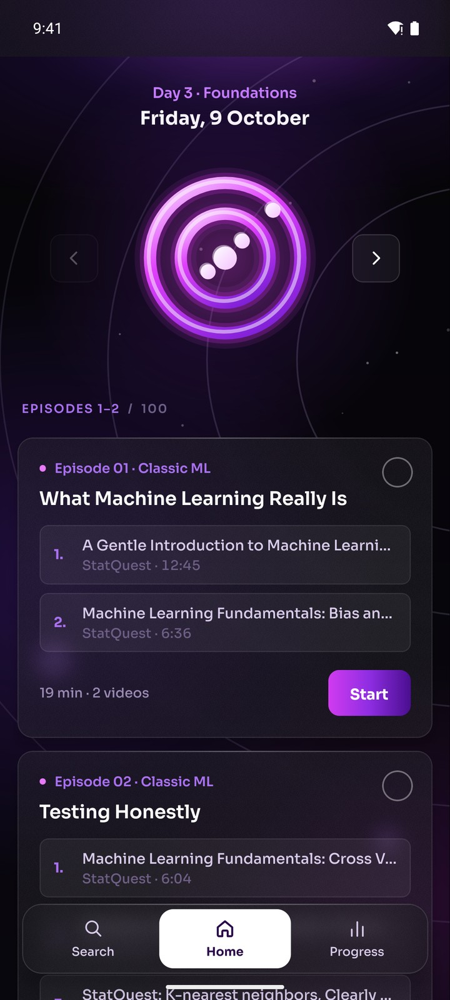
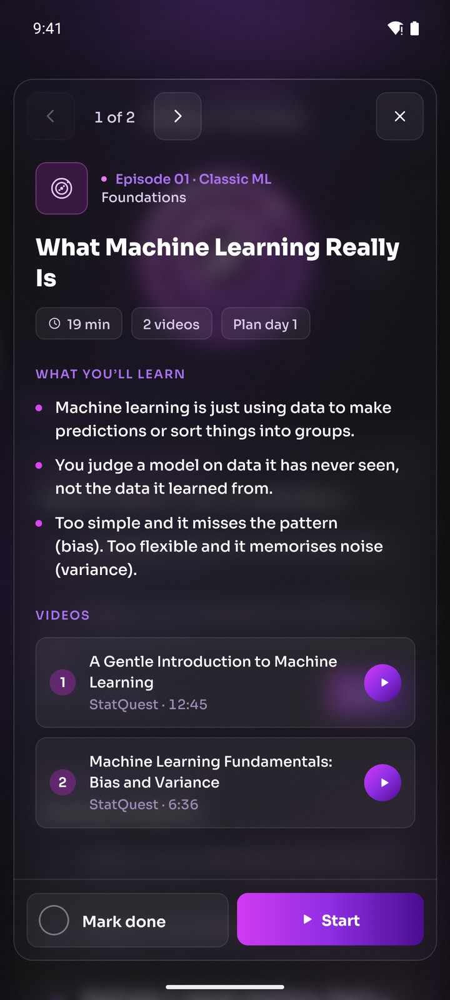
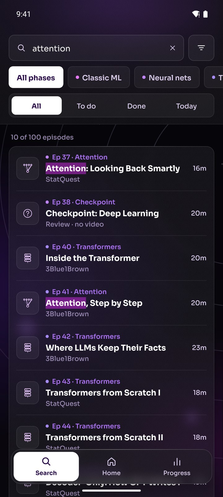
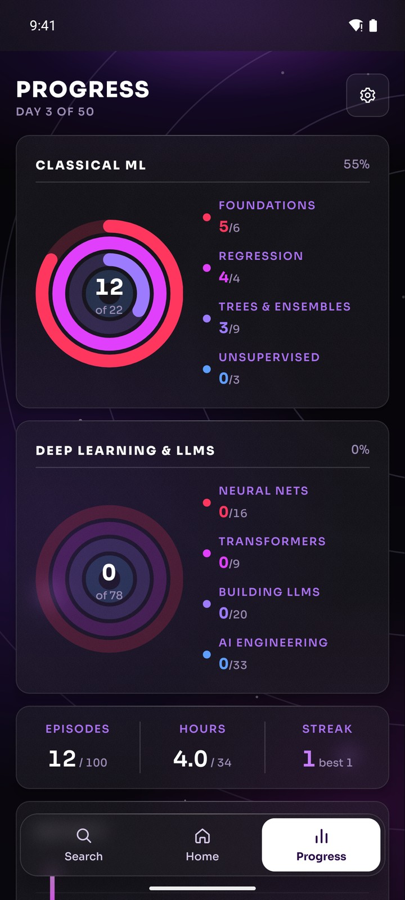
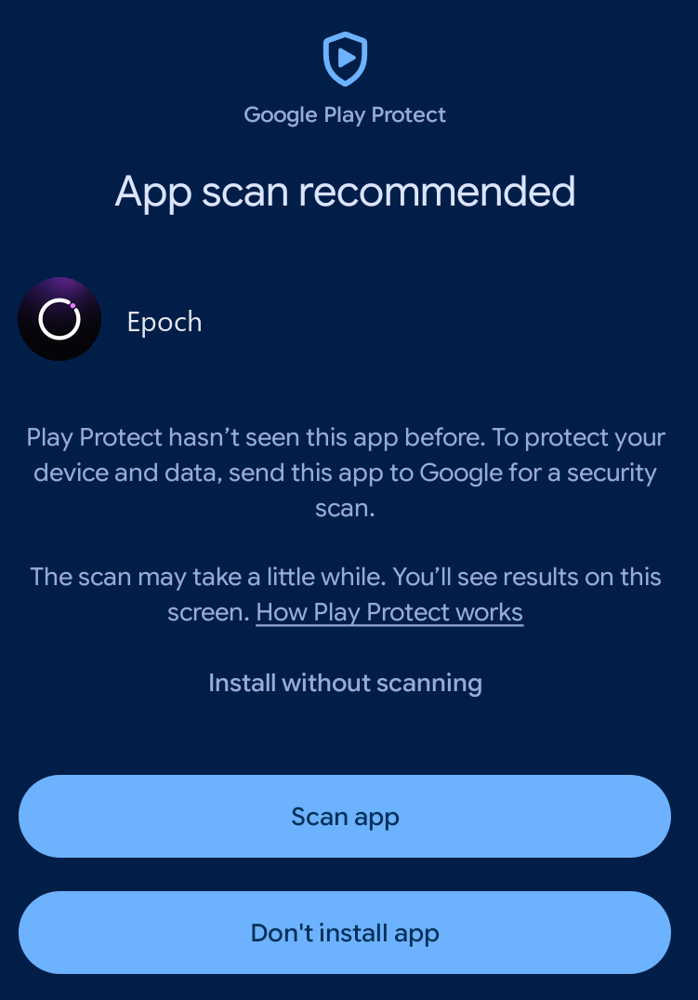

<div align="center">



<br />

**A beginner's introduction to machine learning in 50 days, two short episodes a day.**

<br />

<a href="https://github.com/ShockRock2004/epoch/releases/latest/download/Epoch.apk">
  
</a>

<br />


<br /><br />






</div>

## What this is

Epoch is a simple tool. At heart it is a YouTube playlist of 89 videos from StatQuest, 3Blue1Brown, DeepLearningAI, Andrej Karpathy, Stanford Online, IBM Technology and a few other channels, cut into 100 short episodes so you actually get through it.

The videos aren't mine, and the app teaches nothing they don't. The only thing it adds is the split. You get about 20 minutes a day, in an order that starts with classic ML and ends with how LLMs are trained and turned into agents. A lunch-sized chunk is much easier to keep up with than a 34-hour wall of video.

Treat it as a first look. By the end you should know the main ideas and how they fit together. Building and shipping real models is a separate, longer road.

## What it does

| Screen | What it does |
|---|---|
| Today | Two episodes a day, shown as cards. If you only finish one, the other moves to tomorrow. The arrows page through the rest of the plan when you want to go ahead. |
| Episodes | Each card lists its videos with exact time ranges, and **Start** opens YouTube at the right second. Tap a card for a short summary, or hold it to mark it done. |
| Search | Find any of the 100 episodes by name, topic, channel or summary, and filter by phase or status. |
| Progress | Apple Watch style rings for classic ML and for deep learning and LLMs, plus hours watched and your streak. |

Your progress stays on the phone. There is no account, and the app only talks to the network when it opens YouTube.

## The plan

| Phase | Episodes | Covers |
|---|---|---|
| Classic ML | 1 to 22 | metrics, regression, regularisation, trees, boosting, SVMs, clustering, PCA |
| Neural nets | 23 to 38 | backprop, optimisers, CNNs, RNNs, LSTMs, embeddings, attention |
| Transformers | 39 to 47 | self-attention, decoder-only models, BERT |
| How LLMs are built | 48 to 67 | pretraining, post-training, RLHF, scaling laws |
| AI engineering | 68 to 100 | RAG, fine-tuning, LoRA, agents, MCP, evals, prompting |

Nine of the episodes are review checkpoints. They have no video, just a few questions to answer out loud.

## Install

<table>
  <tr>
    <td width="58%" valign="top">

1. Tap the download button at the top of this page and open `Epoch.apk`.
2. Android will warn you about an unknown source. Let your browser or file manager install apps.
3. Play Protect may ask to scan the app. The way through is the plain text link **Install without scanning** above the two blue buttons.

You need Android 13 or newer on a 64-bit ARM phone, which covers nearly every phone from the last few years.

</td>
    <td width="42%" align="center"></td>
  </tr>
</table>

## Limitations

- It is a playlist with a schedule. There are no exercises, notebooks or grades.
- Watching anything needs YouTube and an internet connection.
- Android only, with no iOS build.
- It is pitched at beginners. If you already know backprop, the first half will drag.

## Credits

The teaching all belongs to the people who made the videos, above all Josh Starmer of StatQuest, who made 44 of the 89. Epoch only links to their videos on YouTube, so go subscribe to them.

## Build from source

Expo SDK 57, React Native 0.86 and TypeScript.

```bash
npm install
npm test                 # schedule logic and plan data
npx tsc --noEmit
npx expo run:android     # dev build on a device or emulator
```

On Windows, build from a short path such as `C:\ep`, or CMake trips over the 260-character path limit. Release APK:

```bash
npx expo prebuild -p android
cd android && ./gradlew assembleRelease
```
